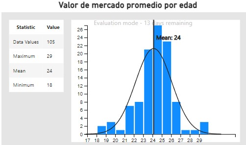
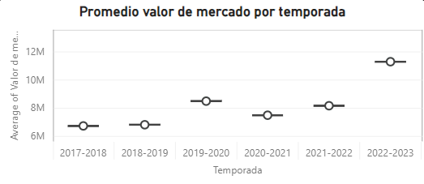

# Proyecto-Final

## Index 🤘

1. [Objetivo](#obj)
2. [Pasos](#pas)
3. [Resultado](#res)
4. [Informacion y links](#info)

<a name="obj"/>

# Objetivo:

Como objetivo de mi proyecto final en Ironhack, mezcle mi fanatsimo por el futbol con mi interes por estudiar las estadisticas que hay de trasfondo a la hora de hablas de valores de mercado, ya sea de las grandes ligas o de estadisticas personales de cada jugador.

Es asi que me decidi a analizar los valores de mercado que manejan las tres grandes ligas del mundo (LaLiga, Premier League y Serie A). Analizando el valor de todos los jugadores de cada liga desde la temporada 2017-2018 y viendo como las estadisticas individuales influyen en su valor de mercado. Y luego poder visualizar el valor de mercado total que maneja cada equipo de su respectiva liga.

<a name="pas"/>

# Pasos:

- Extraccion, transformacion y carga de los datos: Para esta seccion saque mis datos de FBref que una pagina que observa datos especificos de cada jugador y luego utilice transfermarkt para obtener el valor de mercado de cada futbolista.                      
Para esto utilice Selenium y BeautifulSoup, para poder extraer mis datos que luego seran transformados y cargados. En cuanto a la limpieza, limpie columna a columna los datos ingresados y para la columna 'Valor de Mercado', al tener una pequena cantidad de valores faltantes, decidi eliminarlos.
- Luego de obtenidos mis datos ya limpios, procedi a cargarlos a MongoDB para luego poder utilizarla y filtrarla segun el interes del proyecto.
- Ya con los datos procesados, realice algunos test de analisis estadisticos como el principio de pareto y la clusterizacion de mis datos, que luego utilizare para representar mis conclusiones.
- Para poder visualizar y sacar conclusiones al problema, utilice PowerBI en el cual se ven distintas observaciones y analisis dependiendo del enfoque que mas interese. Ya sea valor de mercado por ligas o por estadisticas individuales de cada jugador.

<a name="res"/>

# Resultados

Del analisis estadisitico, ya podemos llegar a las primeras conclusiones. Para comenzar con el principio de Pareto, testeamos si con el 20% de los jugadores mas caros logramos alcanzar el 80% del valor de mercado. Por mas que no se cumplio el principio de Pareto, los resultados son muy cercanos al 80% principalmente en La Liga y en la Serie A. Tambien, realizamos el principio de pareto para ver si los jugadores de cada liga son en su mayoria jugadores de ese mismo pais o no. Obtuvimos el mismo resultado, en el que no se cumple estrictamente el principio pero podemos ver que los valores son muy cercanos al 80%.

Luego realice un proceso de clusterizacion, para poder observar como agrupa los equipos segun su valor de mercado promedio. Asi podemos observar que existen diferencia entre los equipos "grandes" y el resto a la hora de determinar el valor de mercado de sus jugadores.

Como podemos ver en la presentacion de PowerBI, se logra ver esa diferencia que vimos antes en el proceso de clusterizacion, mostrando una interesante diferencia entre estos dos grupos de equipos. Agregando a esto se puede observar como la media de valor de mercado vario temporada a temporada, marcando una tendencia ascendente excepto en tiempos de covid donde hubo una pequena baja pero luego retomo a su alza.

Tambien logramos ver la edad promedio en la que los jugadores llegan a su "prime", siendo esta 24 y donde la mayoria logran su mayor valor de mercado. Podemos ver tambien como segun la posicion del jugador, fueron variando los valores del mercado siendo algunas temporadas mas valiosas ciertas posiciones que otras. Actualmente donde mas se mueve el mercado en cuanto a precio de los jugadores es en base a los delanteros.

 
Histograma Edad

 
Valor de mercado por temporada

