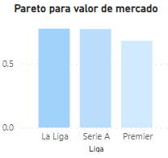

# Proyecto-Final

## Index 🤘

1. [🎯 Objetivo](#obj)
2. [⌛ Pasos](#pas)
3. [✅ Resultados](#res)
4. [👣 Proximos pasos](#prox)
4. [📂 Informacion y links](#info)

<a name="obj"/>

# Objetivo:

Como objetivo de mi proyecto final en Ironhack, mezcle mi fanatismo por el futbol con mi interés por estudiar las variables que hay de trasfondo a la hora de hablar de valores de mercado, ya sea de las grandes ligas o de estadísticas personales de cada jugador.
Es así que me decidí a analizar los valores de mercado que manejan las tres grandes ligas del mundo (LaLiga, Premier League y Serie A). Analizando el valor de todos los jugadores de cada liga desde la temporada 2017-2018 y viendo como las estadísticas individuales influyen en su valor de mercado. Y luego poder visualizar el valor de mercado total que maneja cada equipo de su respectiva liga.

<a name="pas"/>

# Pasos:
•	Extracción, transformación y carga de los datos: Para esta sección saque mis datos de FBref que una página que observa datos específicos de cada jugador y luego utilice transfermarkt para obtener el valor de mercado de cada futbolista.
Para esto utilice Selenium y BeautifulSoup, para poder extraer mis datos que luego serán transformados y cargados. En cuanto a la limpieza, limpie columna a columna los datos ingresados y para la columna 'Valor de Mercado', al tener una pequeña cantidad de valores faltantes, decidí eliminarlos.

•	Luego de obtenidos mis datos ya limpios, procedí a cargarlos a MongoDB para luego poder utilizarla y filtrarla según el interés del proyecto.

•	Ya con los datos procesados, realice algunas pruebas de análisis estadísticos como el principio de Pareto y la cauterización de mis datos, que luego utilizare para representar mis conclusiones.

•	Para poder visualizar y sacar conclusiones al problema, utilice PowerBI en el cual se ven distintas observaciones y análisis dependiendo del enfoque que más interese. Ya sea valor de mercado por ligas o por estadísticas individuales de cada jugador.

<a name="res"/>

# Resultados

Del análisis estadístico, ya podemos llegar a las primeras conclusiones. Para comenzar con el principio de Pareto, testeamos si con el 20% de los jugadores más caros logramos alcanzar el 80% del valor de mercado. Por más que no se cumplió el principio de Pareto, los resultados son muy cercanos al 80% principalmente en La Liga y en la Serie A. También, realizamos el principio de Pareto para ver si los jugadores de cada liga son en su mayoría jugadores de ese mismo país o no. Obtuvimos el mismo resultado, en el que no se cumple estrictamente el principio, pero podemos ver que los valores son muy cercanos al 80%.

Luego realice un proceso de clusterizacion, para poder observar cómo agrupa los equipos según su valor de mercado promedio. Así podemos observar que existen diferencia entre los equipos "grandes" y el resto a la hora de determinar el valor de mercado de sus jugadores.

Como podemos ver en la presentación de PowerBI, se logra ver esa diferencia que vimos antes en el proceso de clusterizacion, mostrando una interesante diferencia entre estos dos grupos de equipos. Agregando a esto se puede observar como la media de valor de mercado vario temporada a temporada, marcando una tendencia ascendente excepto en tiempos de covid donde hubo una pequeña baja, pero luego retomo a su alza.

También logramos ver la edad promedio en la que los jugadores llegan a su "prime", siendo esta 24 y donde la mayoría logran su mayor valor de mercado. Podemos ver también como según la posición del jugador, fueron variando los valores del mercado siendo algunas temporadas más valiosas ciertas posiciones que otras. Actualmente donde más se mueve el mercado en cuanto a precio de los jugadores es en base a los delanteros.

 
Histograma Edad

 
Valor de mercado por temporada

 
Pareto

<a name="prox"/>

# Proximos pasos:

Los siguientes pasos por seguir para este proyecto son los siguientes:

•	Mejorar el modelo predictivo para poder predecir el valor de mercado según estadísticas de los jugadores.

•	Crear un streamlit para poder poner filtros y predecir su valor de mercado

<a name="info"/>

# Informacion y links:

[Pandas](https://pandas.pydata.org/)

[MySQL Workbench](https://www.mysql.com/products/workbench/)

[Selenium](https://www.selenium.dev/)

[Power BI](https://powerbi.microsoft.com/es-es/)

[Sklearn](https://scikit-learn.org/stable/)

[FBref](https://fbref.com/es/)

[Transfermarkt](https://www.transfermarkt.es/)

